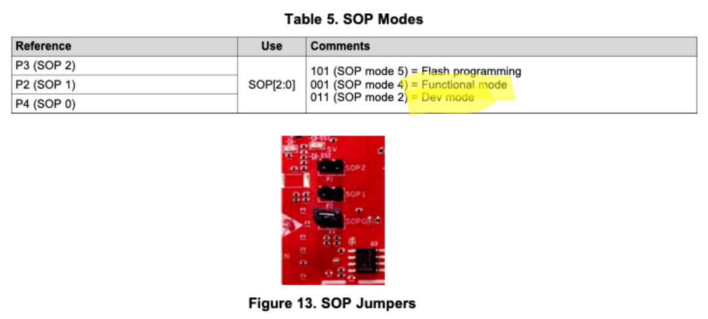
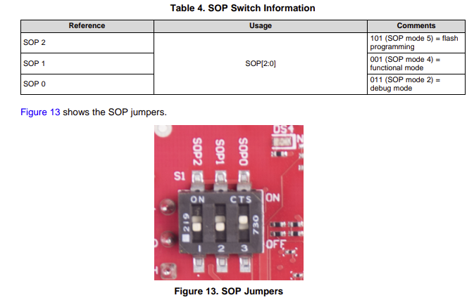

# CPSL_TI_RADAR C++ code

## Installation

### Pre-requisite packages
Before building and installing this package, you must first have the following software installed:
1. C++ compiler (supporting C++ 17)
2. CMake

The driver has no other library dependency: nlohmann/json is a git submodule (`include/json`), and
the serial ports use the Linux termios and `poll` calls directly.

The following installation instructions will work for linux devices, but should be similar for Windows and Mac devices as well.

#### 1. Install C++ compiler
1. First check to see if c+ is installed by running the following command
```
g++ --version
```
If this returns at least version 7 (the first with C++17), you can move onto the next step

2. If you don't have c++ installed or if your c++ version is out of date, run the following command to install c++ (for linux).
```
sudo apt update
sudo apt install build-essential
```

#### 2. Install CMake
1. Next, confirm that CMake is installed. To do this, run the following command:
```
cmake --version
```
2. If it isn't installed, run the following command to install it (for debian based systems including ubuntu)
```
sudo apt update
sudo apt install cmake
```

> **Quick setup.** Steps 3 and 4, and the DCA1000 static IP under "Preparing your hardware", are checked by one command. Run it from the repository root:
> ```bash
> uv run tools/setup/host_setup.py --nic <dca-nic>                    # read-only report: OK / MISSING / WARN / N-A, with the fix for each
> uv run tools/setup/host_setup.py --nic <dca-nic> --apply --dry-run  # print the exact commands and file contents, run nothing
> uv run tools/setup/host_setup.py --nic <dca-nic> --apply            # run them (sudo per command, one confirmation per check)
> ```
> `<dca-nic>` is the wired interface cabled to the DCA1000, for example `enp3s0`. The tool never picks it for you. Without `--nic` it lists the candidates. The report exits 1 while anything is MISSING. Don't run the tool with `sudo`: it calls `sudo` itself for each command, so you see every prompt. Add `--udev` for stable `/dev/radar/<serial>-cli` and `-data` names when more than one XDS110 board is connected. The manual commands below still work if you'd rather do it by hand.

#### 3. Allow access to serial ports
1. Finally, to ensure that your system has access to the serial ports to connect to the radar, run the following command
```
sudo usermod -a -G dialout $USER
```
2. To allow the command to take effect, simply reboot or log out and then log back in on your system

#### 4. System settings for high-rate DCA1000 streaming

At high ADC sampling rates, the default Linux UDP receive buffer (~128 KB) is too small and causes packet drops. The driver never discards a packet itself: when its 512-packet ring is full (the consumer or the worker fell behind) the RX thread stops reading and the socket's receive buffer holds the backlog. So that buffer is what absorbs a stall, and what overflows it shows up as `kernel_drops` in `--stats`. The driver asks for `dca1000.rcvbuf_bytes` (default 64 MB), and the kernel caps that at `net.core.rmem_max` (the granted size, twice the capped value, is the `rcvbuf=` stat and the `SO_RCVBUF granted` line). Keep `rmem_max` at least `rcvbuf_bytes`. At the IWR1843 baseline (~3460 packets/s, ~5 MB/s), 64 MB holds over 10 s of data, so a stall of a few hundred ms loses nothing. Raise the system-wide cap with:
```bash
sudo sysctl -w net.core.rmem_max=134217728
```

To make this permanent across reboots:
```bash
echo 'net.core.rmem_max=134217728' | sudo tee /etc/sysctl.d/99-radar.conf
sudo sysctl -p /etc/sysctl.d/99-radar.conf
```

**Optional: real-time priority.** By default the DCA1000 RX and worker threads run at normal priority (`runtime.rx_priority` / `worker_priority` are 0). Set either key to 1-99 to request SCHED_RR; without permission the driver prints one warning for that thread and runs it at normal priority. To allow it without running as root, either grant the executable the capability after building:
```bash
sudo setcap cap_sys_nice+ep ./build/CPSL_TI_Radar_CPP
```

Or add the following to `/etc/security/limits.conf` (replace `<username>` with your username), then log out and back in:
```
<username>  -  rtprio  99
```

The capability is stored on the binary file, so a rebuild removes it. An `rtprio` limit below the requested priority, such as PipeWire's `@pipewire - rtprio 95` against a request of 99, is not enough.

**Choosing CPUs** (`runtime.rx_cpu`, `runtime.worker_cpu`, optional). By default neither thread is pinned. On a loaded host, pinning keeps the RX thread from being pushed off its CPU while packets arrive: put the RX thread and the DCA worker on two different cores that the rest of your pipeline does not saturate (for example `"rx_cpu": 2, "worker_cpu": 3` on a 4-core machine, leaving 0 and 1 to the system and your consumer). Avoid CPU 0 if it takes most interrupts on your host (`/proc/interrupts`); IRQ affinity of the NIC is not set by the driver. A CPU the process may not use (out of range or outside its cpuset) is a warning and the thread stays unpinned. `bench_pipeline --udp --rx-cpu N --worker-cpu N` measures a placement over loopback.

## Building CPSL_TI_Radar_cpp

To download, build, and install the CPSL_TI_Radar c++ code, perform the following instructions:
1. Clone the repository
```
git clone --recurse-submodules https://github.com/davidmhunt/CPSL_TI_Radar
```

If you forgot to perform the --recurse-submodules when cloning the repository, you can use the following command to load the necessary submodules
```
git submodule update --init --recursive
```

2. Next build and make the project
```
cd CPSL_TI_Radar
cmake -S CPSL_TI_Radar_cpp -B CPSL_TI_Radar_cpp/build
cmake --build CPSL_TI_Radar_cpp/build -j
```
The build type defaults to Release (optimized), so the command above is all you need, and the configure step prints `Build type: Release`. For a debug build, pass it explicitly: `cmake -S CPSL_TI_Radar_cpp -B CPSL_TI_Radar_cpp/build-debug -DCMAKE_BUILD_TYPE=Debug`. An existing build directory keeps the type it was first configured with. `tools/bench` and the `build-type` check in the host-setup doctor expect a Release build, so a plain build passes them.

3. (Optional) Install the libraries and headers, e.g. into a local prefix:
```
cmake --install CPSL_TI_Radar_cpp/build --prefix ~/cpsl_install
```

### Using the driver from another CMake project

The install provides one CMake package, `CPSL_TI_Radar`, exporting one target, `CPSL_TI_Radar::driver`. Linking it brings in all driver libraries, their include directories and their dependencies (Threads, nlohmann_json):
```cmake
cmake_minimum_required(VERSION 3.11)
project(consumer CXX)
find_package(CPSL_TI_Radar REQUIRED)
add_executable(consumer main.cpp)
target_link_libraries(consumer PRIVATE CPSL_TI_Radar::driver)
```
Configure it with `-DCMAKE_PREFIX_PATH=<install prefix>`.

**Renamed in v2.0.** The package was previously found as `find_package(CPSL_TI_Radar_CPP)` with targets such as `CPSL_TI_Radar_CPP::DCA1000Handler`. For one release a deprecated compatibility package of that name is still installed: it calls `find_package(CPSL_TI_Radar)`, defines the old `CPSL_TI_Radar_CPP::<target>` names as aliases (all but `Runner`, which v2.0 removes in favour of `Radar`) and prints a deprecation message. It will be removed after the next release, so switch to `find_package(CPSL_TI_Radar)` and `CPSL_TI_Radar::driver`. Headers are installed under `<prefix>/include/CPSL_TI_Radar_CPP/<subdir>/` and are reached through the target, so `#include "Radar.hpp"` works without extra include paths.

## Running tests

Unit tests live in `tests/` and need no radar, serial port, DCA1000 or network. They use a small in-tree harness (`tests/test_harness.hpp`), so there is nothing extra to install. Building the project builds them; run them with:

```bash
cmake -S CPSL_TI_Radar_cpp -B CPSL_TI_Radar_cpp/build
cmake --build CPSL_TI_Radar_cpp/build -j
ctest --test-dir CPSL_TI_Radar_cpp/build --output-on-failure
```

Each `tests/test_*.cpp` is one executable and one ctest test (config readers, TLV/serial frame parsing, DCA1000 packet assembly, ADC cube conversion, DCA1000 command encoding, frame publish ordering and the frame queue, the stop path: file flush, signal flag, CLI write errors). `test_radar_e2e_fake` runs a whole `Radar` on a fake CLI stream and an in-memory `ReplayPacketSource` (fakes in `tests/fake_transports.hpp`); `test_cli_stop` runs one on a fake CLI stream and a fake DCA1000 on loopback UDP (127.0.0.2); `test_radar_serial_fake` runs one on a fake serial data port, and `test_uart_parse` checks the serial frame parser on golden and malformed frames (fixtures in `tests/uart_test_frames.hpp`). No test opens a real serial port; `test_cli_stop` and `test_serial_latency_pty` use a pseudo-terminal. To add one, write `tests/test_<name>.cpp` with `TEST_CASE`s and a `TEST_MAIN()`, then add an `add_driver_test(...)` line to `tests/CMakeLists.txt`. The tests are characterization tests: they pin current behaviour. `KNOWN_BUG(...)` marks a bug that is not fixed yet; it starts failing once the bug is fixed, which is the cue to turn it into a normal check. Use `-DBUILD_TESTING=OFF` to skip building them.

To run the same suite under AddressSanitizer and UndefinedBehaviorSanitizer (any report fails the test), use the `asan-ubsan` preset from `CPSL_TI_Radar_cpp/` (it builds in `build-asan-ubsan/`):

```bash
cd CPSL_TI_Radar_cpp
cmake --preset asan-ubsan && cmake --build --preset asan-ubsan -j && ctest --preset asan-ubsan
```

`test_board_descriptor` covers the board descriptor files in [`config/boards/`](./config/boards/) (see "Board descriptors" below).

### Replay benchmark (`ctest -C bench -L bench`)

`bench/bench_pipeline` replays synthetic DCA1000 packets (clean, 1% dropped, duplicated/reordered) through `FrameAssembler` and the ADC converter, with no hardware. For each of three converter variants it prints frames/s, CPU ns per ADC byte and heap allocations per frame: (a) the driver's `ADCCubeConverter`, called as `DCA1000Handler` calls it, (b) a nested `[rx][sample][chirp]` cube with a reused buffer, and (c) a flat `[chirp][rx][sample]` buffer. (b) and (c) are bench-only kernels in `bench/converter_kernels.hpp`. The frame shape comes from `config/radar/nav_configs/1843_stress_test.cfg` unless you pass `--cfg`. The test is registered with `CONFIGURATIONS bench`, so the plain `ctest` run above never lists or runs it. `-C bench` adds it and `-L bench` runs only it. Use a Release build for numbers you can compare (the default build type, so the `-DCMAKE_BUILD_TYPE=Release` below is optional):

```bash
cmake -S CPSL_TI_Radar_cpp -B build-release -DCMAKE_BUILD_TYPE=Release
cmake --build build-release -j
ctest --test-dir build-release -C bench -L bench --verbose     # or: build-release/bench/bench_pipeline [--frames N] [--reps N]
build-release/bench/bench_latency                              # frame complete -> next_adc_frame return, µs
build-release/bench/bench_serial_latency --period-ms 50       # serial frame over a pty -> next_point_cloud return, µs
```

The `drv_*` rows (variant `(d)`) replay the same kind of stream through the driver's own `DCA1000Handler` (assembler, converter, frame publish and, for `drv_save`, `adc_data.bin`), the code the DCA worker thread runs. `drv_save` writes to a temp directory (`--tmp-dir`, default `/dev/shm`). Driver log messages go to a counting sink at `--log-level` (default `info`); the count per rep is in the "replay input" notes.

**Perf gate (before/after a change).** Code placement alone can move a short kernel by tens of percent (core-11 measured +76% on unchanged code). So a change is measured in two Release builds of each tree, the default one and the `bench-aligned` preset (`-falign-functions=64 -falign-loops=64`, a measurement build only), with `bench_pipeline --frames 400` run before/after interleaved three times per build. Save each run's stdout under a name with `before`/`after` and `default`/`aligned` in it, then:

```bash
cmake --preset bench-aligned && cmake --build --preset bench-aligned -j --target bench_pipeline
uv run tools/bench/pipeline_gate.py runs/p3_{before,after}_{default,aligned}_{1,2,3}.txt
```

It prints a table per build (the runs' median ns/byte, Δ of the mean, allocs/frame) and fails (exit 1) only if a row is more than 5% slower in **both** builds, if allocations/frame rise, or if an "after" run is not golden. A shift in one build only is reported as layout noise.

**Loopback RX path (`--udp`).** `bench_pipeline --udp` runs the real receive path with no hardware: a sender thread replays the clean synthetic stream over 127.0.0.1 into a `DCA1000Socket` (RX thread, packet ring) and a worker thread runs `DCA1000Handler::process_next_packet`, as the driver's DCA worker does. No DCA1000 command is sent. It prints one `udp ...` line of `key=value` pairs: frames and whether they are golden, packets sent and delivered, `discards` (user-space, the RX ring's overrun count), `kernel_drops` (the socket's drops column in `/proc/net/udp`) and `driver_kernel_drops` (the same count as `Stats::kernel_drops` sees it), `ring_full`, CPU ns per payload byte and the voluntary/involuntary context switches of the RX and worker threads (`getrusage`). It exits 1 only if frames are lost and no counter accounts for them.

```bash
build-release/bench/bench_pipeline --udp --frames 100                          # IWR1843 baseline rate, 3460 packets/s
build-release/bench/bench_pipeline --udp --frames 400 --udp-rate max           # as fast as the sender goes
build-release/bench/bench_pipeline --udp --frames 100 --stall-ms 200           # one 200 ms consumer stall mid-run: 0 discards, 0 kernel drops
build-release/bench/bench_pipeline --udp --frames 100 --stall-ms 1000 --udp-rcvbuf 200000   # a stall beyond the buffer: counted kernel drops
```

`--stall-every K` repeats the stall every K frames; `--rx-cpu` / `--worker-cpu` pin the threads. The paced rate sends packets evenly, so each packet wakes both threads (about 2 context switches per packet); that CPU figure is mostly wake-up cost and moves with the host's idle state, so compare it before/after on one quiet host, interleaved.

## Preparing your hardware

To stream samples from the DCA1000, the following steps must be completed
1. Configure your machine's I.P address for the DCA1000
2. Flash the correct firmware onto the IWR1443

### 1.Setup Static IP Address
`uv run tools/setup/host_setup.py --nic <dca-nic>` checks this and, with `--apply`, adds the address to the NIC's NetworkManager profile without removing its other addresses (see "Quick setup" above). To do it by hand, configure the TCP/IPv4 to have the following settings:
1. Static IP Address
2. IP address: 192.168.33.30
3. Subnet mask: 255.255.255.0

### 2.Flash the correct firmware onto the device
To flash the correct firmware onto the IWR1443, you will need the UNIFLASH tool from Texas Instruments. Start by downloading the correct version of the tool from the [downloads page](https://www.ti.com/tool/UNIFLASH#downloads). Next, follow the instructions below corresponding to the board that you are using.

#### [IWR1443] DCA Streaming
1. Power off the IWR1443, and place it into Flashing Mode mode. Refer to the following diagram for placing the IWR in flashing mode 
3. Use the Uniflash tool to install the binary located in the [firmware folder](../Firmware/DCA1000_Streaming). Make sure you use the firmware in the IWR_Demos folder if streaming data directly from the IWR

#### [IWR1443] IWR Streaming
1. Power off the IWR1443, and place it into Flashing Mode mode. Refer to the following diagram for placing the IWR in flashing mode 
3. Use the Uniflash tool to install the mmWave SDK found as part of the [TI mmWave SDK 2.01.00.04](https://www.ti.com/tool/download/MMWAVE-SDK/02.01.00.04)

#### [IWR1843] DCA Streaming and IWR Demos
1. Power off the IWR1843, and place it into Flashing Mode mode. Refer to the following diagram for placing the IWR in flashing mode 
2. For the IWR1843 (or any radar that can run the mmWave SDK demo), you should be able to load the default "demo" firmware provided by TI onto the board to stream samples to the DCA1000 board.

    a.We developed this pipeline using mmWave 3.6. Using a different pipeline may require slight changes in the code.
    b. NOTE: additional documentation on the demo firmware can be found in the index.html file located in (ti/mmwave_sdk_03_06_02_00-LTS/packages/ti/demo/xwr18xx/mmw/docs/doxygen/html)


#### [AWR2243 2-chip cascade] IWR Demo (serial TLV)
The cascade EVM (AM273x + 2× AWR2243) runs TI's 2-chip cascade DDM demo. Build and flash it with the
[`CPSL_TI_Radar_Firmware_Dev`](https://github.com/davidmhunt/CPSL_TI_Radar_Firmware_Dev) repo
(`scripts/flash_cascade.sh`, J6 jumper on the bottom pins to flash and on the top pins to run), then check it with
`scripts/cascade_serial_check.py` before using this driver.

Once the correct firmware is flashed onto your board, power cycle the board and place it into functional mode.

## Library use

Link `CPSL_TI_Radar::driver` (see above) and use `cpsl::radar::Radar` (header `Radar.hpp`). No call
throws or exits; each returns a `Status` (or a `Result` holding one) whose `message` says what
failed, and log messages go to stderr at `runtime.log_level` unless you install
`cpsl::radar::set_log_sink`.

```cpp
#include "Radar.hpp"
#include <iostream>

int main() {
    namespace radar = cpsl::radar;
    auto cfg = radar::RadarConfig::load("config/system/front_radar_IWR1843_stress_test.json");
    if (!cfg) { std::cerr << cfg.status.message << "\n"; return 1; }
    auto opened = radar::Radar::open(*cfg);       // ports, sockets, output.dir; sends nothing
    if (!opened) { std::cerr << opened.status.message << "\n"; return 1; }
    radar::Radar& r = **opened;
    if (!r.configure() || !r.start()) return 1;    // cfg to the radar, then streaming
    radar::AdcFrame frame;                          // frame.data[rx][sample][chirp]
    for (int i = 0; i < 100 && r.next_adc_frame(frame, std::chrono::milliseconds(1000)); i++) {
        std::cout << "frame " << frame.index << ", " << frame.missing_bytes << " bytes missing\n";
    }
    return r.stop() ? 0 : 1;                        // the destructor would also stop
}
```

`next_adc_frame` blocks until a frame is ready and returns tens of microseconds after it is
complete. Frames come out in order from a queue of `runtime.frame_queue_depth` frames (default
4); if you fall behind, the oldest are dropped and counted in `stats().frames_overwritten`. The
frame is swapped into `frame.data`, not copied, and the buffer it held goes back to the driver's
pool, so reuse one `AdcFrame` (as above) and nothing is allocated per frame. Calling `stop()` from
another thread wakes a waiting `next_adc_frame` at once.

`next_point_cloud` does the same for the serial TLV stream, except that only the newest frame
waits (a frame you did not take in time is counted in `stats().serial_overwritten`). A frame is
handed over as soon as its last byte has been read (well under a millisecond after the radar sends
it, measured on a pty), its points are swapped into `PointCloud::points` like `frame.data`, and
`PointCloud::completed_at` says when it arrived. Which `Point` fields are filled depends on the
board's TLV dialect: on the IWR1443 (`sdk2`) `v`, `snr_db` and `noise_db` are NaN, because its demo
does not send them ([config/boards/README.md](./config/boards/README.md), "TLV dialects").
`docs/ARCHITECTURE.md` lists every
call, the stop sequence, the stall policy and the threads, and the `adc_data.bin` layout ("Output
files").

## Running

To run the cpp code, perform the following:
1. update the .json config file
2. run the c++ code

### 1. Updating the .json config files

The driver reads a **system config** (JSON, schema v2) that names a **board descriptor** and a
**radar `.cfg`**. The tracked system configs are in [config/system](./config/system/). Loading is
strict: an unknown key, a wrong type or a repeated key is an error that names the JSON path. A v1
file (no `"schema_version"`) is rejected with the command that converts it (see the README's
v1 -> v2 migration section).

```json
{
    "schema_version": 2,
    "board": "IWR1843",
    "board_overrides": {},
    "radar_cfg": "../radar/nav_configs/1843_stress_test.cfg",
    "cli": { "port": "/dev/ttyACM0" },
    "serial_stream": { "enabled": false, "port": "/dev/ttyACM1" },
    "dca1000": { "enabled": true, "fpga_ip": "192.168.33.180", "host_ip": "192.168.33.30",
                 "cmd_port": 4096, "data_port": 4098, "rcvbuf_bytes": 67108864 },
    "output": { "dir": "out/front_radar", "save_adc_frames": true, "save_raw_lvds": false },
    "runtime": { "log_level": "info" }
}
```

| Key | Required | Meaning |
|-----|----------|---------|
| `schema_version` | yes | `2` |
| `board` | yes | A board name (`IWR1443`, `IWR1843`, `IWR6843`, `AWR2243_CASCADE`), looked up as `<boards dir>/<name>.json`: the boards dir is `$CPSL_TI_RADAR_BOARDS_DIR` if set, otherwise `../boards` next to the JSON file (the layout of `config/`). Or a path to a descriptor file (relative to the JSON file). |
| `board_overrides` | no | Deep-merged over the descriptor, then validated like it. Baud rates and timeouts live here, for example `{"cli": {"cmd_timeout_ms": 300}, "data_uart": {"baud": 3125000, "timeout_ms": 5000}}`. `cli.stop_timeout_ms` sets how long `sensorStop` waits for `Done`; by default it is `max(cmd_timeout_ms, frame period + 200 ms)`, because the demo answers only after the current frame. |
| `radar_cfg` | yes | The TI `.cfg` sent to the radar. Relative paths resolve against the JSON file's directory; the tracked configs use `../radar/<subdir>/<file>.cfg`. |
| `cli.port` | yes | CLI serial port (usually the lower-numbered `/dev/ttyACM*`; [determine_serial_ports.ipynb](../utilities/determine_serial_ports.ipynb) lists them). |
| `serial_stream.enabled`, `.port` | no | TLV point cloud from the demo over the data UART. `port` is required when enabled. The section may be omitted when off. |
| `dca1000.enabled`, `.fpga_ip`, `.host_ip`, `.cmd_port`, `.data_port` | no | Raw ADC through the DCA1000. The four address fields are required when enabled; the section may be omitted when off. |
| `dca1000.rcvbuf_bytes` | no | `SO_RCVBUF` requested for the data socket (default 67108864; see the host settings above). |
| `output.dir` | no | Where `adc_data.bin` and `LVDS_Raw_0.bin` are written, relative to the JSON file. Unset: the current directory. The driver creates it (with its parents) when it opens the radar; `--validate` says whether it exists or will be created, and fails if a part of the path is a file or the parent is not writable. |
| `output.save_adc_frames` | no | Write every ADC frame to `adc_data.bin` (default `false`): `bytes_per_frame` per frame, for chirp, rx, sample the int16 real then imaginary part, no header (layout unchanged since v1; one write per frame). |
| `output.save_raw_lvds` | no | Write the raw LVDS payload to `LVDS_Raw_0.bin` (default `false`; only needed to debug packet loss). |
| `runtime.log_level` | no | `error`, `warn`, `info` (default) or `debug`: the least severe message printed. `debug` adds a DCA1000 counter line once a second (the v1 `"verbose": true` printed a block per frame), every CLI command and reply, and each skipped cfg command. |
| `runtime.stall_timeout_ms` | no | `0` (default) is off. Above 0: when no frame arrives for that many ms while streaming, the driver warns and the run stops (instead of after 2 s without frames). |
| `runtime.skip_configure` | no | `false` (default). `true` (or the `--skip-configure` flag): open the ports but send no radar cfg, no `sensorStart` and no `sensorStop`, just stream. For a board already configured and streaming this power-up (the cascade accepts a cfg once per power-up); on a board that takes a cfg every run it only logs a warning. |
| `runtime.frame_queue_depth` | no | Completed ADC frames waiting for `next_adc_frame` (1-1024, default 4). When the queue is full the oldest frame is dropped and counted in `frames_overwritten` (`overwritten=` in `--stats`); `1` keeps only the latest frame. Each slot holds one frame buffer, allocated when the radar is opened. Dropped frames are still in `adc_data.bin`. |
| `runtime.rx_cpu`, `.worker_cpu` | no | Pin the DCA1000 RX thread / the DCA worker thread to one CPU (0-1023; default `null`: not pinned). See "Choosing CPUs" above; a CPU that cannot be used is a warning. |
| `runtime.rx_priority`, `.worker_priority` | no | SCHED_RR priority (0-99) requested for the RX thread and the DCA worker; default 0 = normal priority. Above 0 needs `cap_sys_nice` or an `rtprio` limit; without it, one warning and normal priority. |

At least one of `serial_stream` and `dca1000` must be enabled.

Notes on the radar `.cfg` for DCA1000 streaming with the mmWave SDK demos (for example SDK 3.5 on
the IWR1843): `lvdsStreamCfg -1 0 1 0` streams ADC samples only. `lvdsStreamCfg -1 1 1 1` also
enables the LVDS header and SW data, which costs extra processing and streaming time. The
load-time cross-check requires `dataFmt` (third field) to be 1, ADC.
With SDK 3+ and a single Rx, use an even number of ADC samples, and use 1, 2 or 4 receivers.

#### Board descriptors
[`config/boards/`](./config/boards/) holds one descriptor per board. It gives the board's CLI
handshake, cfg field layout (`cfg_dialect`), data-UART baud/timeout/TLV format, LVDS lanes,
layout and I/Q order, DCA1000 packet settings, and whether the demo accepts a cfg only once per
boot. [`config/boards/README.md`](./config/boards/README.md) cites the source of every value.
Every board-specific behaviour in the driver comes from these files, so adding or tuning a board
with a known wire format is a data change, not a rebuild.

| Board | LVDS lanes | ADC layout | Serial TLV |
|---|---|---|---|
| `IWR1843` | 2 | `two_lane_iq_pairs` (non-interleaved, SDK 3+) | yes |
| `IWR6843` | 2 | `two_lane_iq_pairs` (non-interleaved, SDK 3+) | yes |
| `IWR1443` | 4 | `lane_per_rx` (interleaved, SDK 2) | yes (`sdk2`: x, y, z only; format confirmed from TI source, not yet run on the board) |
| `IWR1843_SAR` | 2 | `two_lane_iq_pairs` | no (SAR firmware has no data UART) |
| `AWR2243_CASCADE` | not supported yet | — | yes (3,125,000 baud) |

At load time the driver cross-checks the radar `.cfg` against the board (16-bit complex ADC,
`adcbufCfg` interleave vs the LVDS layout, `lvdsStreamCfg` ADC streaming) and refuses a mismatch
with a message. `cfg_dialect.skip_commands` lists cfg commands the board's firmware rejects. They
stay in the `.cfg` file but are never sent: no shipped board skips anything (the SDK 3.6 IWR1843 demo needs `calibData`). `required_commands` and
`forbidden_commands` make the cross-check fail when a cfg lacks or contains a command.

##### IWR1843 SAR firmware example
For the `iwr1843_sar_lvds` firmware (see [`docs/firmware.md`](../docs/firmware.md)) use
[`radar_0_IWR1843_SAR.json`](./config/system/radar_0_IWR1843_SAR.json) (`"board": "IWR1843_SAR"`,
DCA1000 on, `serial_stream` off) with
[`sar_configs/1843_SAR_2ms_fmt1.cfg`](./config/radar/sar_configs/1843_SAR_2ms_fmt1.cfg). Set the CLI port
for your EVM. The board requires `calibData` and rejects stock-demo commands such as `guiMonitor`, so a
stock cfg fails the load naming the command. Only `lvdsStreamCfg ... dataFmt 1` is supported (`dataFmt 2`
decoding is planned, core-24). There is no TLV point cloud on this firmware. Check without hardware:
`CPSL_TI_Radar_CPP --validate config/system/radar_0_IWR1843_SAR.json`.

##### AWR2243 cascade notes
* Use [`radar_0_AWR2243_cascade_serial.json`](./config/system/radar_0_AWR2243_cascade_serial.json) with
  [`cascade_shortrange.cfg`](./config/radar/cascade/cascade_shortrange.cfg). Replace the port paths
  with the EVM's `/dev/serial/by-id/...` paths. Use the Application/User UART for the CLI and the other port for data.
  The descriptor sets the 5000 ms command timeout and the 3,125,000 baud data port.
* **Configure only once per boot.** TI doesn't support stopping the cascade demo and sending a new config. Power-cycle
  the EVM before every run. If any config command isn't acknowledged, the driver doesn't start and prints a
  power-cycle reminder (`lifecycle.config_once_per_boot`).
* `channelCfg` has 5 fields (`<rxMaster> <txMaster> <cascading> <rxSlave> <txSlave>`), so the Rx count is master + slave (8).
  `frameCfg` adds `<numAdcSamples>` before the frame period. The descriptor's `cfg_dialect` says so.
* DCA1000 streaming is rejected for this board until 4-lane LVDS capture is added.
* TI has only tested up to 192 ADC samples, 256 chirps, and 8 Rx channels. BFP compression isn't supported.
* With `guiMonitor` detectedObjects 3 (TI's default) the demo sends compact points (TLV 12), which the driver does
  not decode: point clouds stay empty and the driver warns once. The driver's `cascade_shortrange.cfg` uses 1.

### 2. Radar .cfg file

Several sample .cfg files are located in the [config/radar](./config/radar/) folder. For generating additional configurations, we recommend using the [TI mmWave Demo Visualizer](https://dev.ti.com/gallery/view/mmwave/mmWave_Demo_Visualizer/ver/2.1.0/). There, you can specify settings, and then use the "Save config to PC" button to download a configuration. To fully understand the configurations, please refer to the mmWave sdk documentation. 
* To understand a particular configuration, there are a few helpful notebooks located in the [utilities](../utilities/) folder including the [print_config](../utilities/print_config.ipynb) notebook which will parse the config and print its commands. 


### 3. Run the project

The system config path is a required argument:

```bash
cd CPSL_TI_Radar/CPSL_TI_Radar_cpp/build

# check a config without hardware: loads the board descriptor and radar cfg, runs the
# cross-checks, prints the board, ports, frame shape, bytes/frame, output.dir and skipped
# commands; opens no port or socket; exit 0 if usable, 1 otherwise
./CPSL_TI_Radar_CPP ../config/system/front_radar_IWR1843_stress_test.json --validate

# run it
./CPSL_TI_Radar_CPP ../config/system/front_radar_IWR1843_stress_test.json

# run 300 frames (or 30 s), printing a stats line every second
./CPSL_TI_Radar_CPP ../config/system/front_radar_IWR1843_stress_test.json --frames 300 --stats
./CPSL_TI_Radar_CPP ../config/system/front_radar_IWR1843_stress_test.json --duration 30
```

| Flag | Effect |
|------|--------|
| `--validate` | Check the config as above, then exit. |
| `--stats` | Print a `stats v1 dca ...` / `stats v1 serial ...` line per stream every second and once after the stop: frames, packets, drops, late and duplicate packets, user-space discards (`overrun`, always 0 since core-15), overwritten frames, stalls, granted `SO_RCVBUF`, kernel drops, ring-full waits, implausible packets and resyncs (format and meanings in `docs/ARCHITECTURE.md`). `tools/bench` reads these lines. |
| `--frames N` | Stop after N completed frames (DCA1000 frames if enabled, otherwise TLV frames). |
| `--duration S` | Stop after S seconds of streaming. |

Stop a run with Ctrl-C (or SIGTERM): the driver finishes the frame loop, sends `sensorStop` and the DCA1000 `recordStop`, and flushes and closes `adc_data.bin`, which then holds exactly `bytes_per_frame` x frames. A second Ctrl-C kills it at once (only needed if the stop hangs). The run also ends by itself when no frame arrives for 2 s (or after `runtime.stall_timeout_ms`, when set). The exit status is 0 after a clean stop and 1 if stopping hit an I/O error, e.g. the radar's USB was unplugged, or an output file failed to flush; the output files are closed either way.

Running without an argument prints the usage and exits with status 2. The executable prints the
config path at startup so you can confirm which file is loaded. A rebuild is only needed after
changes to source code: switching configs or editing a board descriptor does not require recompiling.
